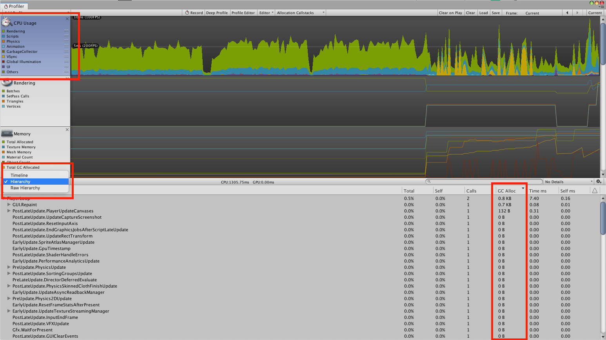

# UnityOptimization

# c# script optimize

## Unity 内存管理机制

Unity的GC机制，使用了Boehm GC算法[Boehm](https://en.wikipedia.org/wiki/Boehm_garbage_collector)，是非分代（non-generational）和非压缩（non-compacting）的。"非分代"是指GC执行清理操作时，必须遍历整个内存，并且随着内存的增长，它的性能就会降低。“非压缩”意味着内存中的对象不会被重新定位，去缩小对象之间的内存空隙。注意啦，这点和传统c#的GC机制不同。

## 合理使用Unity Profiler工具进行优化




## 不在Update方法中创建新对象,一次创建，多次重用

``` c# example 1

//bad code
private List<GameObject> objectsList;
void Update()
{
    objectsList = new List<GameObject>();
    objectsList.Add(......)
}

//better code
private List<GameObject> objectsList;
void Start()
{
    objectsList = new List<GameObject>();
}

void Update()
{
    objectsList.Clear();
    objectsList.Add(......)
}

```

``` c# example 2

//bad code
void Update()
{
    var levelObstacles = FindObjectsOfType<Obstacle>();
    foreach(var obstacle in levelObstacles) 
        { ....... }
}

//better code
private Object[] levelObstacles;
void Start()
{
    levelObstacles = FindObjectsOfType<Obstacle>();
}

void Update()
{
    foreach(var obstacle in levelObstacles)
     { ....... }
}

```

## 小心处理字符串，避免字符串连接,慎用string，动态字符串用stringbuilder替代,减少GC。

``` c# example 1

//bad code
void Start()
{
    text = GetComponent<Text>();
}

void Update()
{
    text.text = "Player " + name + " has score " + score.toString();
}

//better code
void Start()
{
    text = GetComponent<Text>();
    builder = new StringBuilder(50);
}

void Update()
{
    //StringBuilder为所有类型重载了Append方法
    builder.Length = 0;
    builder.Append("Player ");
    builder.Append(name);
    builder.Append(" has score ");
    builder.Append(score);
    text.text = builder.ToString();
｝

```

## 缓存访问器返回的数值

``` c# example 1

//bad code
void Update()
{
    //分配包含所有touches的新数组
    Input.touches[0];
}

//better code
void Update()
{
    Input.GetTouch(0);
}

// bad code
void Update()
{
    //返回新的字符串（垃圾），然后对比2个字符串
    gameObject.Tag == "MyTag";
}

// better code
void Update()
{
    gameObject.CompareTag("MyTag");
}

```

## 使用NonAlloc函数

``` c# example 1

// bad code
Physics2D.CircleCast();

// better code
Physics2D.CircleCastNonAlloc();

```

## 合理使用LINQ，LINQ会产生GC。


## 使用对象池，对象重复使用

``` c# example 

public class ObjectPool<T> where T : new()
{
    private Stack<T> objs;
 
    public ObjectPool(){
        objs = new Stack<T>();
    }
    // 获取对象池里的对象
    public T GetObject(){
        T obj = objs.Count > 0 ? objs.Pop() : new T();
        return obj;
    }
    // 回收对象池里的对象
    public void ReturnObject(T obj){
        if (obj != null)
            objs.Push(obj);
    }
}

```


## 注意装箱过程


``` c# example  

// bad code

Dicitonary<enum,Transform> _dic; // enum作为key, add时会进行boxing

// better code 

Dictionary<int, Transform> _dic;

}

```

## Update中慎用循环遍历，会增加cpu负担，造成发热量过大

``` c# example 

//bad code

Dictionary<int, object> _dic;
void Update()
{
  foreach(var value in _dic.values)
  {
      ...
  }
}

// better code
object[] _arr; //容器改为内置数组
bool _isUpdate //添加判定条件,减少遍历次数
void Update()
{
    if(_isUpdate)  
    {
        foreach(var value in _arr)
        {
            ...
        }
    }
}

```

## 通过Unity Profiler 检查外部引用库是否产生GC


## 正确的执行顺序 从FixedUpdate,Update，LateUpdate转移到 Awake，Start

``` C# example

// bad code

void Update()
{
    gameObject.GetComponent<LineRenderer>();
    gameObject.GetComponent<CircleCollider2D>();
    //Examples of calculations returning same result every frame
    Mathf.FloorToInt(Screen.width / 2);
    var width = 2f * mainCamera.orthographicSize * mainCamera.aspect;
    var castRadius = circleCollider.radius * transform.lossyScale.x;
    var halfSize = GetComponent<SpriteRenderer>().bounds.size.x / 2f;
    //Finding objects
    var levelObstacles = FindObjectsOfType<Obstacle>();
    var levelCollectibles = FindGameObjectsWithTag("COLLECTIBLE");
    //References
    objectTransform = gameObject.transform;
    mainCamera = Camera.main;
}

// better code
void Start()
{
    gameObject.GetComponent<LineRenderer>();
    gameObject.GetComponent<CircleCollider2D>();
    //Examples of calculations returning same result every frame
    Mathf.FloorToInt(Screen.width / 2);
    var width = 2f * mainCamera.orthographicSize * mainCamera.aspect;
    var castRadius = circleCollider.radius * transform.lossyScale.x;
    var halfSize = GetComponent<SpriteRenderer>().bounds.size.x / 2f;
    //Finding objects
    var levelObstacles = FindObjectsOfType<Obstacle>();
    var levelCollectibles = FindGameObjectsWithTag("COLLECTIBLE");
    //References
    objectTransform = gameObject.transform;
    mainCamera = Camera.main;
}

```
## 在需要时执行相关代码，尤其注意在Update中执行多次循环操作

``` c# example 

// bad code

Text text;
GameState gameState;
void Start()
{
    gameState = StoreProvider.Get<GameState>();    
    text = GetComponent<Text>();
}
void Update()
{
    text.text = gameState.CollectedCollectibles.ToString();
}

// better code

Text text;
GameState gameState;
int collectiblesCount;
void Start()
{
    gameState = StoreProvider.Get<GameState>();    
    text = GetComponent<Text>();
    collectiblesCount = gameState.CollectedCollectibles;
}
void Update()
{
    if(collectiblesCount != gameState.CollectedCollectibles) {
        
        //This code is ran only about 5 times each level
        collectiblesCount = gameState.CollectedCollectibles;
        text.text = collectiblesCount.ToString();
    }
}

```


## 尽量用For替代Foreach，Foreach循环编写起来很简单，但是执行起来“非常复杂”。Foreach循环内部使用迭代器迭代给定的数据集并返回值。这比在简单的For循环中迭代索引要复杂得多。

``` c# example

// bad code

foreach (GameObject obstacle in obstacles)

// better code

var count = obstacles.Count;
for (int i = 0; i < count; i++)
{
    obstacles[i];
}

```

## 固定长度数据尽量用[],其效率高于 List

``` c# example

// bad code

List<string> list = new List<string>(100);

// better code

string[] arr = new string[100];

```

## Float运算优于Vector运算

``` c# example

Vector3 pos1 = new Vector3(1,2,3);
Vector3 pos2 = new Vector3(4,5,6);

//Bad code
var pos3 = pos1 + pos2;

//Better code
var pos3 = new Vector3(pos1.x + pos2.x, pos1.y + pos2.y, ......);
Vector3 pos1 = new Vector3(1,2,3);

//Bad code
var pos2 = pos1 * 2f;

//Better code
var pos2 = new Vector3(pos1.x * 2f, pos1.y * 2f, ......);

```

## 慎用GameObject.Find()，这个方法消耗很大，可用 GameObject.FindWithTag()替代，最好的方式是在场景中序列化引用

``` c# example

// Bad Code
GameObject player;
void Start()
{
    player = GameObject.Find("PLAYER");
}

// Better Code
//在场景编辑器中序列化
[SerializeField]
GameObject player;
void Start()
{
}

```

## 只处理相关对象，例如在射线检测中分层级检测。

``` c# example

//Bad Code

void DetectCollision()
{
    var count = Physics2D.CircleCastNonAlloc(
       position, radius, direction, results, distance);
    for (int i = 0; i < count; i++) {
       var obj = results[i].collider.transform.gameObject;
       if(obj.CompareTag("FOO")) {
           ProcessCollision(results[i]);
       }
    }
}
//Better Code

void DetectCollision()
{
    //设置检测layer
    var mask = 1 << 8;
    var count = Physics2D.CircleCastNonAlloc(
       position, radius, direction, results, distance, mask);
    for (int i = 0; i < count; i++) {
       ProcessCollision(results[i]);
    }
}

```

## 正确使用Tags

``` c# example

//Bad Code
gameObject.Tag == "MyTag";

//Better Code
gameObject.CompareTag("MyTag");

```

## 正确使用Camera

``` c# example

//Bad code
void Update()
{
    Camera.main.orthographicSize //Some operation with camera
}

//Better Code
private Camera cam;
void Start()
{
    cam = Camera.main;
}
void Update()
{
    cam.orthographicSize //Some operation with camera
}

```

##  LocalPosition优于Position，Transform.Position中有其他相关操作。


# reference

[How We Optimised Our Scripts in Unity]https://medium.com/lonely-vertex-development/how-we-optimised-our-scripts-in-unity-447924863b3a

[BestPracticeUnderstandingPerformanceInUnity]https://docs.unity3d.com/Manual/BestPracticeUnderstandingPerformanceInUnity8.html
